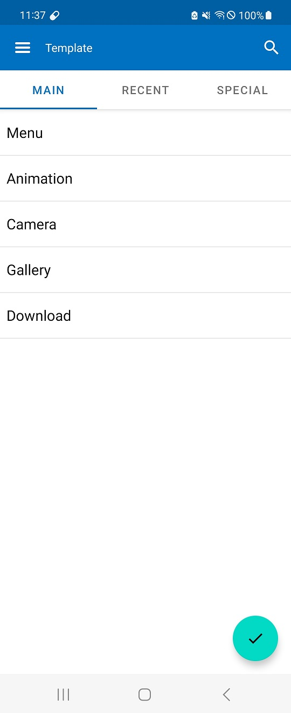

# Android Template App With library

* **This** is an Android Template App to test important functions in the latest version of Android SDK.
*  **Template** is based on MVVM architecture that help developing of android apps rapidly 
and contains base classes, many useful views and utils including retrofit, guava, exoplayer, logging and etc.

## :hammer: How to build app
* Open this project in Android Studio 'Hedgehog'.
* Add this line on build.gradle of 'app' level. 
````
....
implementation 'com.github.happymario:template-android:0.0.2'
....
````
* Run or debug this app.

## :camera: Screenshots
| Dark Mode | Light Mode |
| :---: | :---: |
|  |  |

## :ok_woman: Features
* "Main": It contains with Menu, Animation, Camera&Gallery and Download functions.
* "Recent": It contains with Background Utils, Compose and Hilt features that implements Github API View.
* "Special": It shows methods using Bluetooth and Calenader Views.

## :blue_book: Test
----
We are planning unit test cases on thia app. Have fun!


## :coffee: Sponsor
-------

- [VictoriaMobile](http://inlight.xyz) -- A fantastic mobile and web development company. 


